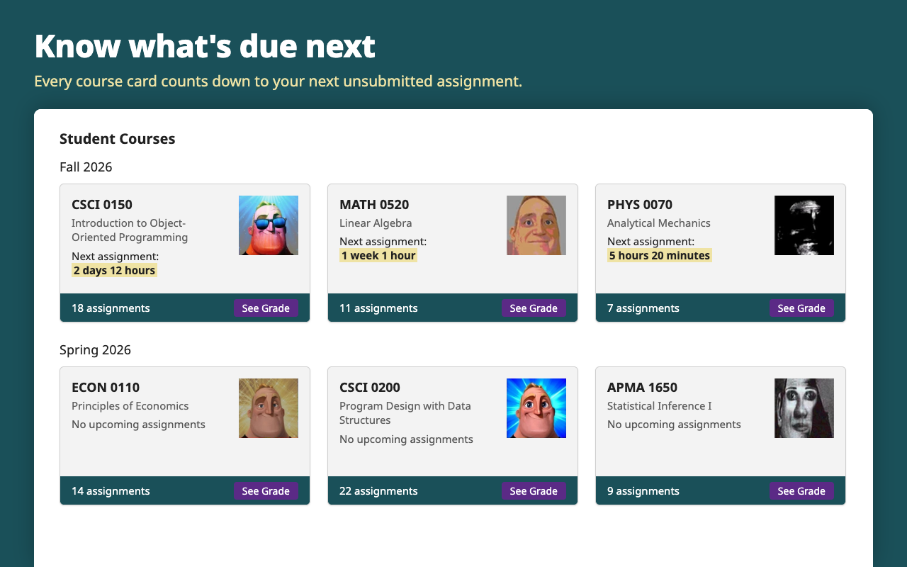
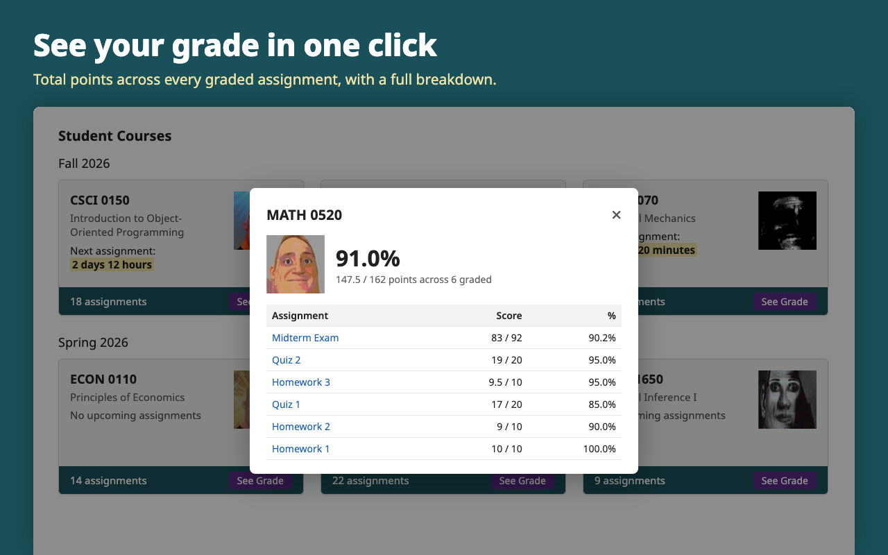
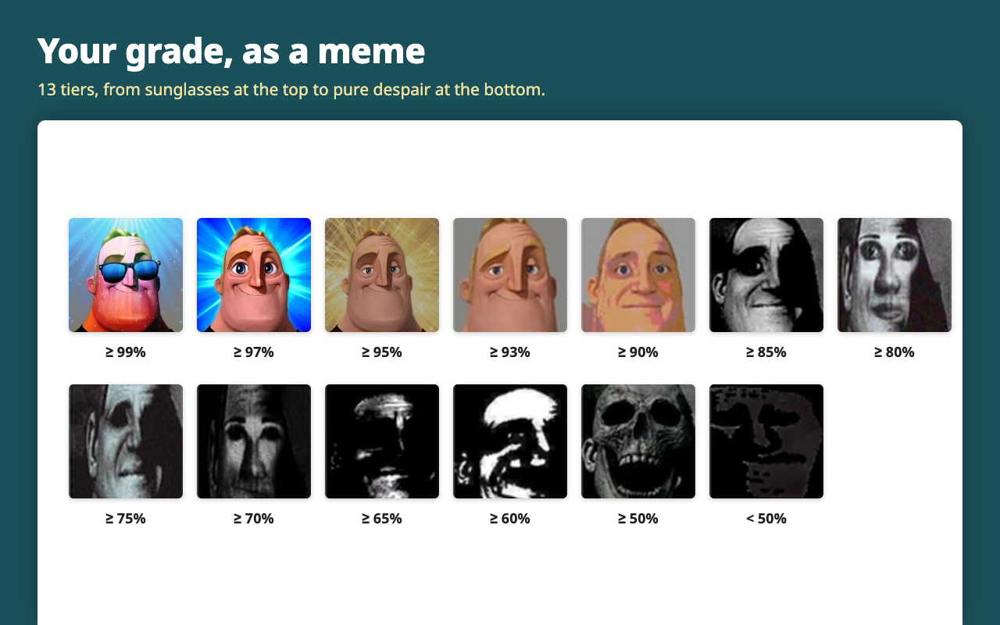
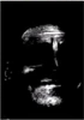

# Gradescope+

Chrome extension that adds to each **Student Courses** card on the Gradescope dashboard:

- **Next assignment:** countdown to the earliest unsubmitted assignment that is not yet past its regular due date.
- A "Mr. Incredible becoming uncanny" meme picked from your grade (total points earned / possible across graded assignments).
- A **See Grade** button that opens a per-assignment score breakdown.

Course pages are fetched in the background and cached for 10 minutes. Countdowns refresh every minute.

   
   
  

## Install

1. Open `chrome://extensions` and turn on **Developer mode**.
2. Click **Load unpacked** and select this folder.
3. Disable the old grade/next-assignment extension so the two don't both draw on the cards.

## Publish

Bump `version` in `manifest.json`, run `scripts/package.sh`, and upload the zip from `dist/` in the [Chrome Web Store developer dashboard](https://chrome.google.com/webstore/devconsole). Listing text and privacy answers are in `store/`.

## Layout

| Path | Contents |
|------|----------|
| `manifest.json`, `content.js`, `content.css` | The extension |
| `images/` | Grade meme tiers |
| `icons/` | Extension icons |
| `store/` | Web Store listing text, privacy policy, store icon |
| `store/src/`, `store/images/` | HTML sources and rendered store screenshots and promo tiles |
| `scripts/package.sh` | Builds the upload zip into `dist/` |
| `scripts/render-store-images.sh` | Renders `store/src/` into `store/images/` with headless Chrome |

## Grade tiers

Edit `GRADE_TIERS` in `content.js`. Images are `images/tier1.png` (best) to `images/tier13.png` (worst).

| Grade | Tier | Image |
|-------|------|-------|
| ≥ 99% | tier1 |  |
| ≥ 97% | tier2 |  |
| ≥ 95% | tier3 |  |
| ≥ 93% | tier4 |  |
| ≥ 90% | tier5 |  |
| ≥ 85% | tier6 |  |
| ≥ 80% | tier7 |  |
| ≥ 75% | tier8 |  |
| ≥ 70% | tier9 |  |
| ≥ 65% | tier10 |  |
| ≥ 60% | tier11 |  |
| ≥ 50% | tier12 |  |
| < 50% | tier13 |  |

Courses with no graded work show tier4 (the neutral face).
